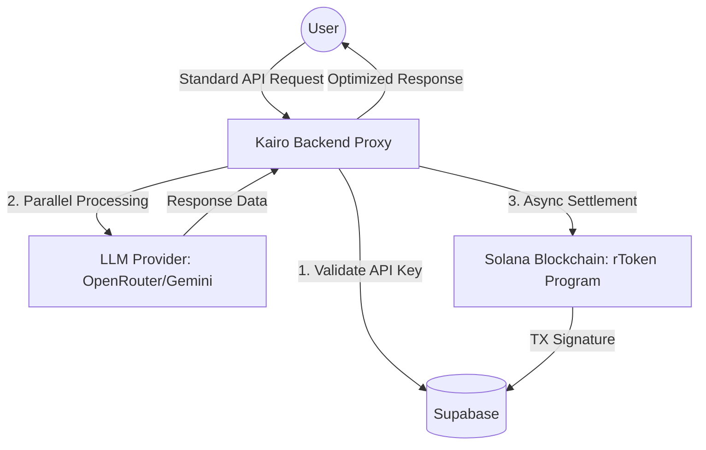

# Kairo: LLM Booster & rToken Protocol

Kairo is a high-performance LLM proxy and token optimization protocol built on Solana. It enables "Wallet-less Checkout" for AI tokens, allowing users to pay with traditional methods while settling usage on-chain via the rToken standard.

## 🚀 Architecture Overview



## ✨ Key Features

- **rTokens (Reward Tokens)**: Every request generates fractional rTokens, giving users up to 1.5x more value for their credit.
- **Wallet-less Checkout**: Users don't need a browser wallet (Phantom/Solflare). Kairo handles deterministic key management in the background.
- **BYOK (Bring Your Own Key)**: Support for OpenAI, Gemini, and OpenRouter keys with automated optimization.
- **Live Dashboard**: Real-time logging of latency, token usage, and blockchain settlement signatures.

## 🛠️ Technical Stack

- **Frontend**: React 18, Vite, Tailwind CSS, Shadcn UI, Framer Motion.
- **Backend**: Node.js (ES Modules), Express, Supabase.
- **Blockchain**: Solana (Anchor Protocol), Rust.
- **Infrastructure**: Vercel (Serverless Functions).

## ⚙️ Environment Variables (Backend)

| Variable                       | Description                                          |
| ------------------------------ | ---------------------------------------------------- |
| `SUPABASE_KAIRO_URL`         | Your standalone Supabase project URL                 |
| `SUPABASE_KAIRO_SERVICE_KEY` | Service role key for backend DB access               |
| `OPENAI_API_KEY`             | (Optional) For direct OpenAI requests                |
| `GEMINI_API_KEY`             | (Optional) For Google AI requests                    |
| `OPENROUTER_API_KEY`         | (Recommended) For aggregated free models             |
| `SOLANA_RPC`                 | Solana RPC URL (e.g., https://api.devnet.solana.com) |

## 📦 Setup & Development

1. **Clone & Install**:

   ```bash
   git clone https://github.com/katherinBK/llm-booster-token.git
   cd llm-booster-token
   npm install
   ```
2. **Frontend Dev**:

   ```bash
   npm run dev
   ```
3. **Backend Dev**:

   ```bash
   cd backend
   npm run dev
   ```

   ## Testing

   Credentials with real data for validation:

   Mail: kathe73207@gmail.com

   Password: Kat123

   Note: If you are signing up, the verification email could take 3 to 5 minutes to come, hang in there and after verificating your email, login with your credentials, it should work!

Checkout our explorer! :Transaction | 4N6rYBPxvZKN5UdidFNDpRkzYGqPKuPcgLjkssBywEymvQMsn1f8vJ6AWxghKPiGGP5JsBoqjx3LQi1pnBavFoLh | Solana

## 📄 License

MIT License. Built for the future of decentralized AI.
